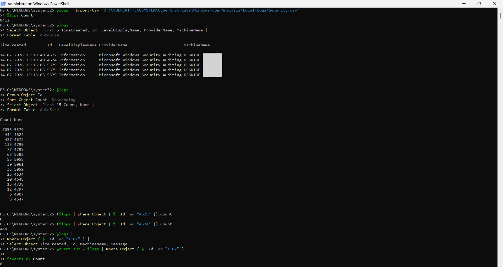
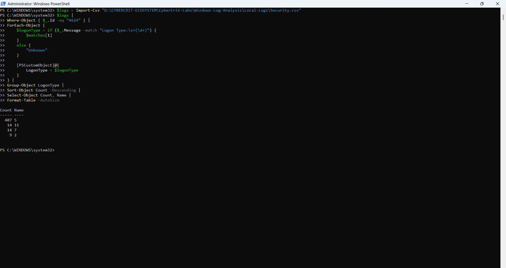
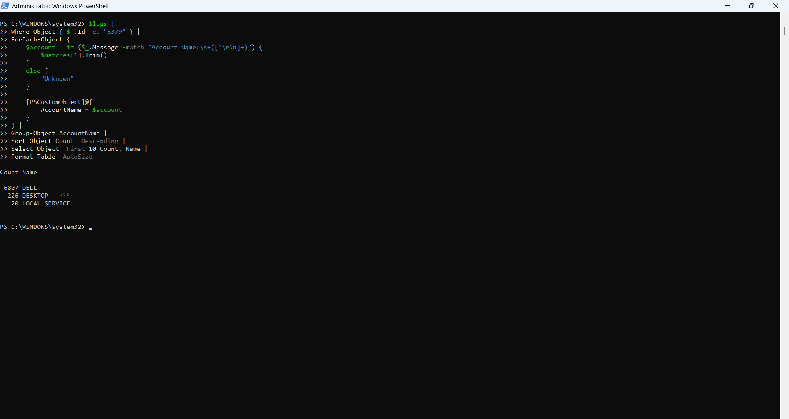
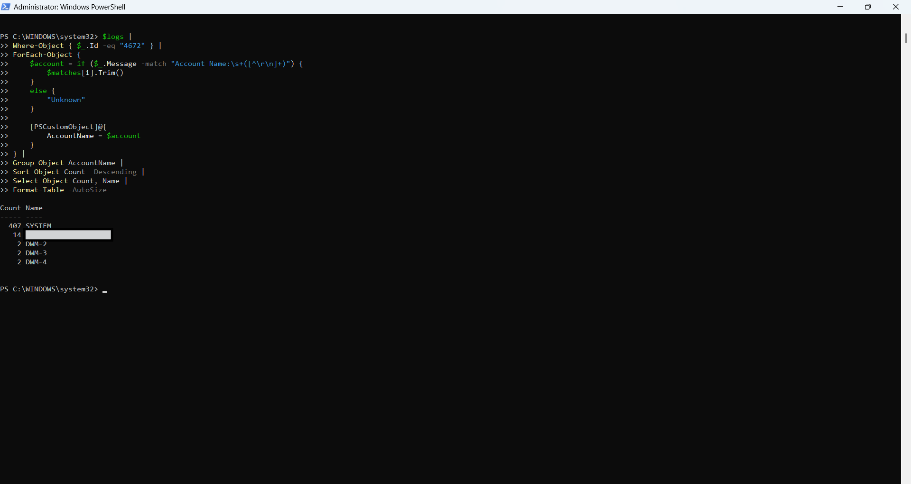

# Windows Security Log Analysis

## Overview

This project demonstrates how Windows Security Event Logs can be exported using PowerShell and analysed to identify authentication activity, privileged logons, Credential Manager access, and audit-log clearing events.

The analysis covers 8,412 Security events collected from the previous seven days.

## Objectives

- Export Windows Security Event Logs using PowerShell
- Analyse the most frequent Security Event IDs
- Review successful and failed logon activity
- Classify successful logons by logon type
- Investigate privileged logon events
- Analyse Credential Manager activity by account category
- Check for Security audit-log clearing
- Document findings, limitations, and privacy considerations

## Tools Used

- Windows 11
- PowerShell
- Windows Security Event Log
- CSV
- Markdown
- GitHub

## Dataset Summary

| Metric | Result |
|---|---:|
| Total events analysed | 8,412 |
| Successful logons — Event ID 4624 | 444 |
| Failed logons — Event ID 4625 | 0 |
| Privileged logons — Event ID 4672 | 427 |
| Credential Manager reads — Event ID 5379 | 7,053 |
| Security log cleared — Event ID 1102 | 0 |

## Key Findings

- Event ID 5379 was the most frequent event, with 7,053 occurrences.
- Most Credential Manager activity was associated with the primary local user account.
- Most successful logons were Type 5 service logons.
- Most privileged logons were associated with the SYSTEM account.
- No failed logons were captured in the reviewed dataset.
- No Remote Desktop logons were identified.
- No Security audit-log clearing events were identified.

## Successful Logon Types

| Logon Type | Count | Description |
|---|---:|---|
| 5 | 407 | Service logon |
| 11 | 14 | Cached interactive logon |
| 7 | 14 | Workstation unlock |
| 2 | 9 | Interactive local logon |

## Repository Structure

```text
windows-security-log-analysis
├── Local-Logs
│   └── Security.csv        # Local only — excluded by .gitignore
├── Reports
│   └── Initial-Findings.md
├── Screenshots
│   ├── 01-Windows-Security-Log-Summary-Redacted.png
│   ├── 02-Successful-Logon-Type-Analysis.png
│   ├── 03-Credential-Manager-Account-Summary-Redacted.png
│   └── 04-Privileged-Logon-Account-Summary-Redacted.png
├── Scripts
│   └── Export-SecurityLogs.ps1
├── .gitignore
└── README.md
```

## Project Workflow

1. Exported Windows Security logs from the previous seven days.
2. Saved selected fields to a UTF-8 CSV file.
3. Grouped and reviewed the most frequent Event IDs.
4. Analysed successful and failed logons.
5. Classified Event ID 4624 records by logon type.
6. Reviewed privileged-logon activity using Event ID 4672.
7. Analysed Credential Manager activity using Event ID 5379.
8. Checked for Event ID 1102 audit-log clearing.
9. Documented findings, limitations, and privacy considerations.

## Screenshots

### Security Event Summary



### Successful Logon Type Analysis



### Credential Manager Account Analysis



### Privileged Logon Account Analysis



## Skills Demonstrated

- Windows Security Event Log analysis
- PowerShell scripting
- Authentication-event investigation
- Privileged-account monitoring
- Credential Manager event analysis
- SOC-style investigation and reporting
- Markdown documentation
- Data redaction and privacy protection

## Limitations

- The dataset covers only the previous seven days.
- Audit-policy settings may affect which events are available.
- Event counts alone cannot determine whether activity is malicious.
- Credential-target details were unavailable in the rendered Event ID 5379 CSV messages.
- Deeper analysis would require process, network, account, and timestamp correlation.

## Privacy Notice

The original `Security.csv` file is excluded from the public repository because it may contain usernames, machine names, account identifiers, process details, and other sensitive system information.

All public screenshots have been redacted.

## Full Report

[Read the complete findings report](Reports/Initial-Findings.md)